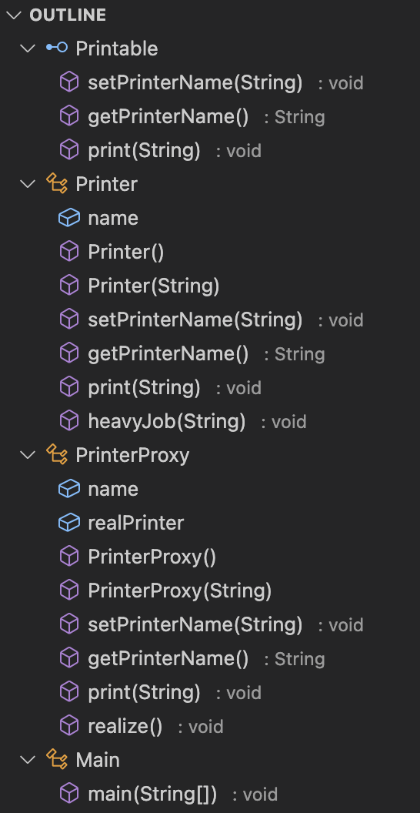

# Proxy 패턴 (필요해지면 만든다)

## Proxy 패턴을 사용해야할 때

- 클래스의 인스턴스 생성이 오래걸릴 때
- 생성 또는 메소드의 작업이 오래걸릴 때

## Proxy 패턴의 핵심

- 오래걸리는 작업을 Lazy(게으르게) 하게 처리한다.

---

## Lazy란?

- 게으른, 느린
- 알고리즘에서도 Lazy 처리 알고리즘이 존재한다.

### 예시(느린, 게으른 삭제)

[느린 삭제 코드 Example.java](./Example.java)

- 중간중간 값을 삭제하거나 추가함
- 최종 배열에서 최댓값과 최솟값을 알아내야 함
- 중간중간 삭제하는 것보다 기록 후 일괄적으로 삭제하는 것이 오버헤드가 적다.
- 즉, 최댓값과 최솟값이 필요할 때, 일괄적으로 삭제하는 것

---

## Proxy 예제 코드

[Proxy 예제 코드](./Main.java)



- Printable: 프록시를 위한 인터페이스
- Printer: 인터페이스 구현체(실제 사용할 객체, 무거운 작업 포함)
- PrinterProxy: Printer의 프록시
- Main: PrinterProxy를 통해 Printer에 접근

## Proxy의 장점

- 무거운 연산, 인스턴스 생성이 오래걸릴 때 활용한다.
- 인스턴스의 생성 타이밍을 인스턴스 사용 직전까지 의도적으로 늦춰 리소스를 낭비하지 않는다.

## `synchronized` 키워드를 활용한 락킹

```java
private synchronized void realize() {
        if (realPrinter == null) {
            realPrinter = new Printer(name);
        }
}
```

- 인스턴스 생성을 늦추기 위해 의도적으로 늦추기 위해 인스턴스 생성 코드를 생성자와 분리
- 이때 인스턴스의 중복 생성을 방지하기 위해 `synchronized` 키워드로 중복 생성을 방지
- `synchronized` 키워드는 스레드가 해당 메소드를 한번에 한번만 호출하는 것을 보장함

---

### 락킹 개선 사항, Double Checked Locking

```java
private void realize() {
    if (realPrinter == null) {
        synchronized (this) {
            if (realPrinter == null) {
                realPrinter = new Printer(name);
            }
        }
}
```

- 메소드 전체를 락을 걸지 않고, 생성하는 부분만 락을 걸어 성능 향상을 할 수 있음
- 성능향상 포인트
  - 인스턴스가 생성되었을 때에는 락이 걸리지 않아도 됨
  - 메소드가 한번에 여러 요청을 처리할 수 있다.
  - 간단하게 표현: 줄서서 대기하지 않아도 된다.

---

## 면접에서 사용할 한 줄 문장

> 프록시 패턴이란 무거운 작업을 가진 인스턴스의 느린 생성을 위해 사용하며, 리소스를 효율적으로 사용할 수 있게 해줍니다.

